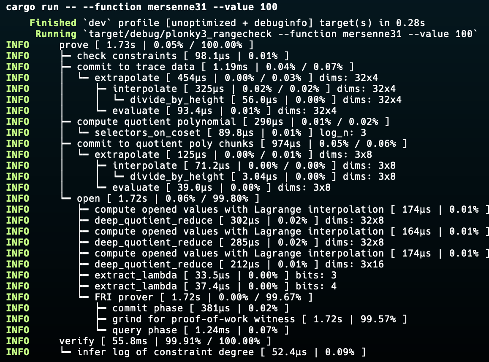
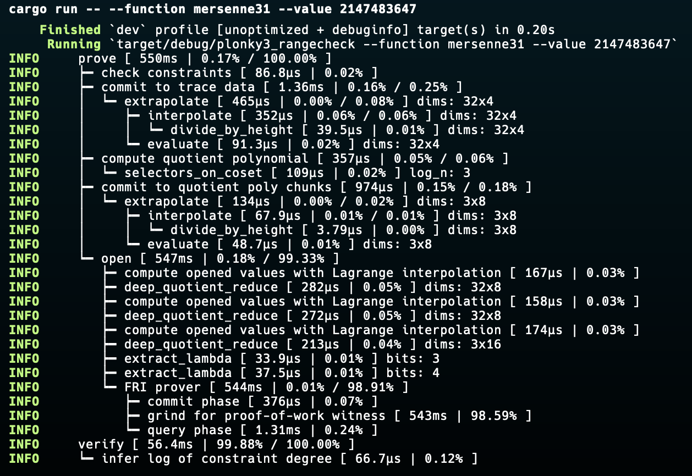
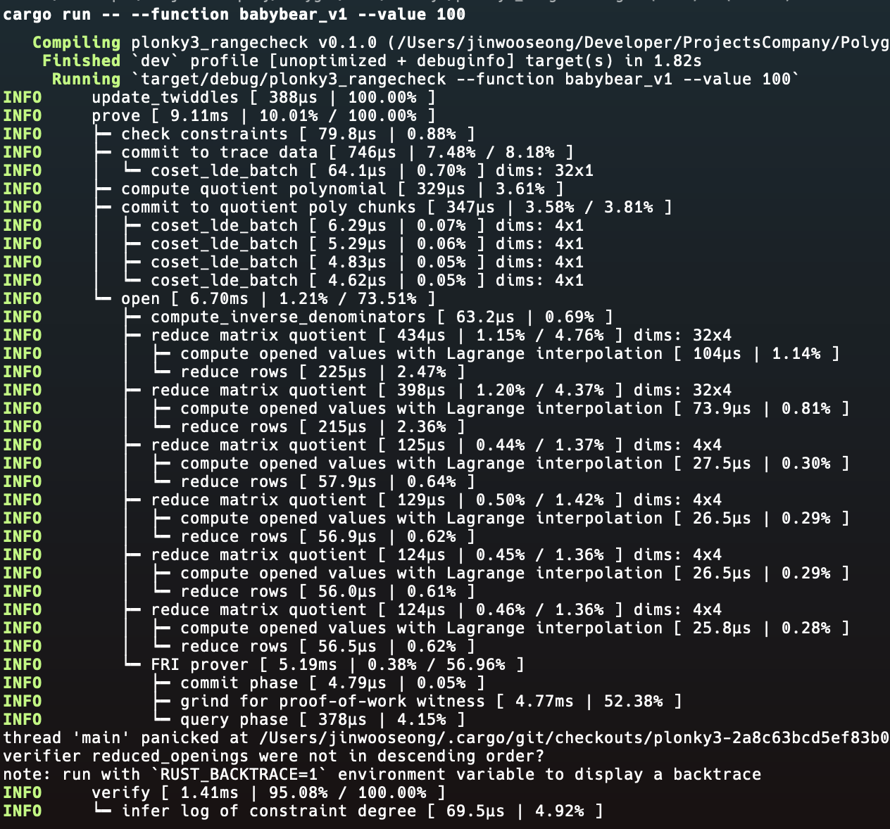
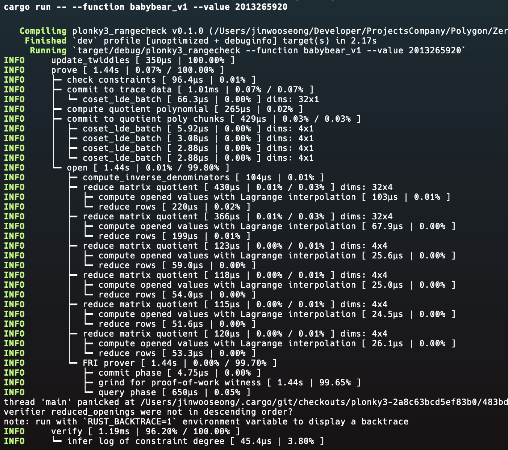

# Range Check Implementations in Plonky3

<div align="center">
  <p align="center">
    <a href="http://makeapullrequest.com">
      
    </a>
    <a href="https://twitter.com/BrianSeong99">
      
    </a>
  </p>
</div>

## Introduction to Range Checks in Zero Knowledge Proofs

Range checks are fundamental operations in zero-knowledge proof systems. They allow us to prove that a value lies within a specific range without revealing the actual value. This is crucial for many applications, including:

1. Privacy-preserving financial transactions
2. Secure voting systems
3. Age verification without revealing exact birth dates
4. Salary range proofs for loan applications
5. zkVM word size checking
6. and more...

In the context of zero-knowledge proofs, a range check typically involves proving that a number is less than a certain value or falls within a specific interval.

## Plonky3 Range Check Implementations
If you are building any of the above systems on top of Plonky3, there are several ways to build range check constraints for different range and have it optimized. In this tutorial, I have created 4 examples, where each tailored to different finite fields and optimization levels. We'll explore four implementations, progressing from simple to more complex:

- Mersenne31 (m31) - The simplest implementation
- BabyBear v1 - A basic implementation for the BabyBear field
- Goldilocks v1 - Range check for the Goldilocks field
- BabyBear v2 - An optimized version of BabyBear (inspired by [SP1](https://github.com/succinctlabs/sp1/blob/dev/crates/core/machine/src/operations/baby_bear_range.rs) from Succinct Labs)

## Mersenne31 (m31) Range Check

### Overview

The Mersenne31 range check is the simplest implementation in our series. It's based on the Mersenne prime $2^{31}-1$, which allows for efficient arithmetic operations. The range check ensures that the value is less than $2^{31}-1$. 

Plonky3 Settings:
- **Field**: Mersenne31
- **Hash**: Keccak256
- **PCS**: CirclePcs

### Execution Trace

|row\col|0 col|1 col|2 col|3 col|4 col|5 col|6 col|7 col|8 col|9 col|10 col|11 col|12 col|13 col|14 col|15 col|16 col|17 col|18 col|19 col|20 col|21 col|22 col|23 col|24 col|25 col|26 col|27 col|28 col|29 col|30 col|31 col|
|-|-|-|-|-|-|-|-|-|-|-|-|-|-|-|-|-|-|-|-|-|-|-|-|-|-|-|-|-|-|-|-|-|
|0 row|0|1|1|1|1|1|1|1|1|1|1|1|1|1|1|1|1|1|1|1|1|1|1|1|1|1|1|1|1|1|1|1|
|1 row|0|0|0|0|0|0|0|0|0|0|0|0|0|0|0|0|0|0|0|0|0|0|0|0|0|0|0|0|0|0|0|0|
|2 row|0|0|0|0|0|0|0|0|0|0|0|0|0|0|0|0|0|0|0|0|0|0|0|0|0|0|0|0|0|0|0|0|
|3 row|0|0|0|0|0|0|0|0|0|0|0|0|0|0|0|0|0|0|0|0|0|0|0|0|0|0|0|0|0|0|0|0|

We are using `0th` row as the row to store the number to be checked, in the above execution trace example, its storing the number $2^{31}-1$. It is stored in bit decomposition form(We will explain why we are using bit decomposition in later section), in big endian format. The rest of the rows are filled with zeros.

*The reason why we need extra three rows is because the CirclePCS requires at least 4 rows to generate proof.*

```rust
pub fn generate_mersenne31_trace<F: Field>(value: u32) -> RowMajorMatrix<F> {
    let mut bits = Vec::with_capacity(32 * 4); // 32 bits per row, 4 rows, CirclePCS requires 4 rows
    // Convert the value to binary, in big endian format
    for i in (0..32).rev() {
        if (value & (1 << i)) != 0 {
            bits.push(F::one());
        } else {
            bits.push(F::zero());
        }
    }
    // Adding three extra rows of zeros
    for _ in 0..32*3 {
        bits.push(F::zero());
    }
    RowMajorMatrix::new(bits, 32)
}

```

### Constraints

For constraints in range checks in m31, there are several conditions to satisfy:
1. **The most significant bit is zero**: Guaranteeing the value is less than 2^31.
2. **Each bit is either 0 or 1**: Since we are using bit decomposition, we need to make sure every value in col 1 to col 31 is either 0 or 1.
3. **The reconstructed value matches the input**: The reconstructed value from the bit decomposition should match the original value.
4. **(Optional) Checking the sum of the remaining three rows is zero**: This is to ensure that the sum of the remaining three rows is zero. The reason why this is optional is because regardless of the value of the remaining three rows, the proofs result is not affected. *In this example, I am only showing this process as an example to show how the constraint works.*

> Note: in Plonky3, `when_transition()` is not applied when checking the last row iteration, therefore if you want to check constraints in the last row, you need to use `when_last_row()`

```rust
pub struct Mersenne31RangeCheckAir {
    pub value: u32, // define constraint input, value is assigned to check against the reconstructed value.
}

// Mersenne31 Modulus in big endian format
// 01111111 11111111 11111111 11111111
// 2^31 - 1
impl<F: Field> BaseAir<F> for Mersenne31RangeCheckAir {
    fn width(&self) -> usize {
        32 // 1 number per row
    }
}

impl<AB: AirBuilder> Air<AB> for Mersenne31RangeCheckAir {
    fn eval(&self, builder: &mut AB) {
        let main = builder.main();
        let current_row = main.row_slice(0);
        let next_row = main.row_slice(1);

        // Assert that the most significant bit is zero, only checked when its first row
        builder.when_first_row().assert_eq(current_row[0], AB::Expr::zero());

        // initializing the `reconstructed_value` and the `next_row_sum`
        let mut reconstructed_value = AB::Expr::zero();
        let mut next_row_rowsum = AB::Expr::zero();
        for i in 0..32 {
            let bit = current_row[i];
            builder.assert_bool(bit); 
            reconstructed_value += AB::Expr::from_wrapped_u32(1 << (31-i)) * bit; // using `from_wrapped_u32` to make sure the value is in range of 31 bits.
            next_row_rowsum += next_row[i].into(); // converting the input to Expr and adding it to the sum.
        }

        // Assert if the reconstructed value matches the original value, only checked when its first row
        builder.when_first_row().assert_eq(AB::Expr::from_wrapped_u32(self.value), reconstructed_value);
        // Assert if the sum of each remaining row is zero in every transition. 
        builder.when_transition().assert_eq(next_row_rowsum, AB::Expr::zero());
    }
}
```

### Proof & Verify

The Plonky3 Prover & Verifier config can be found in `m31.rs` file. We will explore configuration in details in later chapters, for now we are going to use the template we provided in [here](https://github.com/Plonky3/Plonky3/tree/main/keccak-air/examples).

#### Test the range with number 100:

```bash
cargo run -- --function mersenne31 --value 100
```



> Successfully verified! Proving time is `1.73s` and Verification time is `55.8ms`.

#### Test the range with number $2^{31}-1$:

```bash
cargo run -- --function mersenne31 --value 2147483647
```



> Successfully verified! Proving time is `550ms` and Verification time is `56.4ms`.

#### Test the range with number $2^{32}-1$:

```bash
cargo run -- --function mersenne31 --value 4294967295
```


> Proof Generation failed! Since its significant bit is 1, it is out of range.

## BabyBear Range Check (v1): A Basic Implementation

### Overview

BabyBear is a field designed for efficient STARK proofs. The v1 implementation of the BabyBear range check introduces more complex constraints than the previous Mersenne31 range check example.
BabyBear has a modulus of 0x78000001($2^{31}-2^{27} + 1$), which is a 32-bit prime. The range check in BabyBear v1 introduces more complex constraints to handle the specific structure of the field.

Plonky3 Settings:
- **Field**: BabyBear
- **Hash**: Keccak256
- **PCS**: TwoAdicFriPcs

### Execution Trace

|row\col|0 col|1 col|2 col|3 col|4 col|5 col|6 col|7 col|8 col|9 col|10 col|11 col|12 col|13 col|14 col|15 col|16 col|17 col|18 col|19 col|20 col|21 col|22 col|23 col|24 col|25 col|26 col|27 col|28 col|29 col|30 col|31 col|
|-|-|-|-|-|-|-|-|-|-|-|-|-|-|-|-|-|-|-|-|-|-|-|-|-|-|-|-|-|-|-|-|-|
|0 row|0|1|1|1|1|0|0|0|0|0|0|0|0|0|0|0|0|0|0|0|0|0|0|0|0|0|0|0|0|0|0|0|0|

We are using `0th` row as the row to store the number to be checked, in the above execution trace, its storing the number $2^{31}-2^{27} + 1$. It is stored in bit decomposition form, in big endian format. In this example, it doesn't require addition rows, since we are not using `CirclePcs`.

```rust
pub fn generate_trace<F: Field>(value: u32) -> RowMajorMatrix<F> {
    let mut bits = Vec::with_capacity(32); // 32 bits per row
    // Convert the value to binary, in big endian format
    for i in (0..32).rev() {
        if (value & (1 << i)) != 0 {
            bits.push(F::one());
        } else {
            bits.push(F::zero());
        }
    }
    RowMajorMatrix::new(bits, 32)
}
```

### Constraints

For constraints in range checks in BabyBear, there are several conditions to satisfy:
1. **The most significant bit is zero**: Guaranteeing the value is less than 2^31.
2. **Check if bits from 2nd to 5th are one**: If its true, then remaining bits must be zero.
3. **Check if the reamaining bits are zero**: If 2nd contraint is true, the has to be all zero, other wise it can be anything between 1 or zero.
4. **Each bit is either 0 or 1**: Since we are using bit decomposition, we need to make sure every value in col 1 to col 31 is either 0 or 1.
5. **The reconstructed value matches the input**: The reconstructed value from the bit decomposition should match the original value.

```rust
pub struct BabyBearRangeCheckAir {
    pub value: u32, // define constraint input, value is assigned to check against the reconstructed value.
}

// Baby Bear Modulus in big endian format
// 01111000 00000000 00000000 00000001
impl<F: Field> BaseAir<F> for BabyBearRangeCheckAir {
    fn width(&self) -> usize {
        32
    }
}

impl<AB: AirBuilder> Air<AB> for BabyBearRangeCheckAir {
    fn eval(&self, builder: &mut AB) {
        let main = builder.main();
        let current_row = main.row_slice(0);

        // Assert that the most significant bit is zero
        builder.assert_eq(current_row[0], AB::Expr::zero());

        // Value to check if the 2nd to 5th bits are all one
        let upper_bits_product = current_row[1..5].iter().map(|&bit| bit.into()).product::<AB::Expr>();
        // Value to check if the sum of the remaining bits is zero, only if `upper_bits_product` is 1.
        let remaining_bits_sum = current_row[5..32].iter().map(|&bit | bit.into()).sum::<AB::Expr>();
        
        // Assert if the 2nd to 5th bits are all one, then `remaining_bits_sum` has to be zero.
        builder.when(upper_bits_product.clone()).assert_zero(remaining_bits_sum);

        // initializing the `reconstructed_value`
        let mut reconstructed_value = AB::Expr::zero();
        for i in 0..32 {
            let bit = current_row[i];
            // Making sure every bit is either 0 or 1
            builder.assert_bool(bit);
            reconstructed_value += AB::Expr::from_wrapped_u32(1 << (31-i)) * bit; // using `from_wrapped_u32` to make sure the value is in range of 32 bits.
        }

        // Assert if the reconstructed value matches the original value
        builder.when_first_row().assert_eq(AB::Expr::from_wrapped_u32(self.value), reconstructed_value);
    }
}
```

### Proof & Verify

The Plonky3 Prover & Verifier config can be found in `babybear_v1.rs` file.

#### Test the range with number 100:

```bash
cargo run -- --function babybear_v1 --value 100
```



> Successfully verified! Proving time is `9.11ms` and Verification time is `1.41ms`.

> You might wonder what is that `panicked` message, it is a logging message since we are running it in debug mode. You can run the program with `cargo run --release -- --function babybear_v1 --value 100` to examine the program in release mode without the logging message. The performance of debugging mode and release mode is actually quite different as well.

#### Test the range with number $2^{31}-2^{27}$:

```bash
cargo run -- --function babybear_v1 --value 2013265920
```



> Successfully verified! Proving time is `1.44s` and Verification time is `1.19ms`.

#### Test the range with number $2^{31}-2^{27}+1$:

```bash
cargo run -- --function babybear_v1 --value 2013265921
```


> Proof Generation failed! Since the remaining bits sum is not zero.